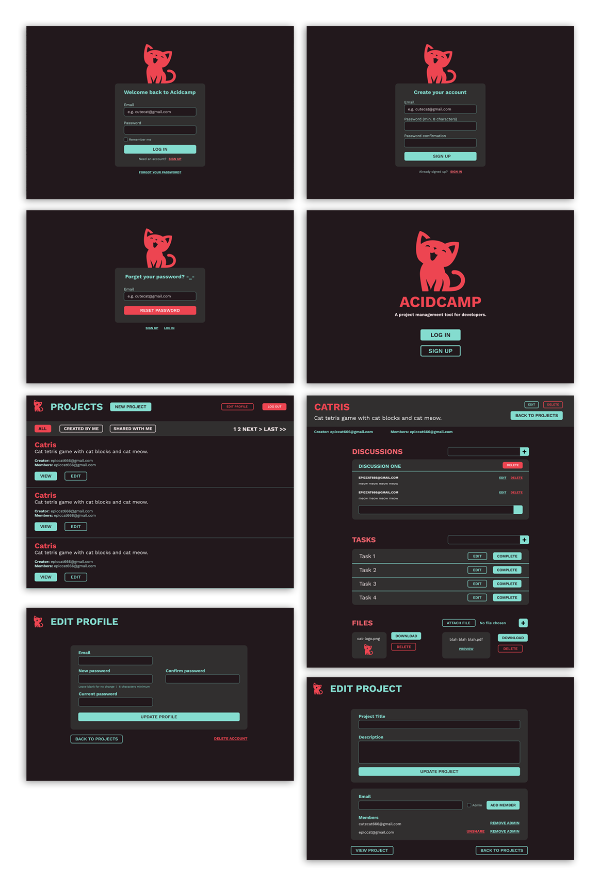

# Acidcamp

Acidcamp is a Basecamp clone; a project management and team communication application. My partner designed this project in Figma and I built it using Rails 7 + TailwindCSS.

Live: 

## High Fidelity Wireframe made in Figma

---
## Setup
```bash
bundle install
rails server
bin/rails tailwindcss:watch
```
---

## Gems/Tools used
- Devise for authentication
- Pundit and Rolify for authorization
- ActiveStorage to upload, preview, display, and download images
- ActionCable + Turbo Streams to utilize websockets for real-time discussion rooms
- Hotwire (Turbo and Stimulus) to increase responsiveness
- Kaminari for pagination
- TailwindCSS and DaisyUI for styling
- PostgreSQL - Database
- RSpec w/ Shoulda-matchers - Testing
- Hosted on Heroku
---

## Made By
- UX Design by [Helen Yu](https://www.linkedin.com/in/helenyustudio/)
- Coded by [Ted Tran](https://www.linkedin.com/in/tedtran2019/)
---
## Conclusions
Hotwire is rather interesting, but I think I'd rather use React + Redux for my frontend. I'll be using this repository to test new Rails 7 features as they're released or to test out gems. It was a blast styling this application with TailwindCSS + DaisyUI.

---
